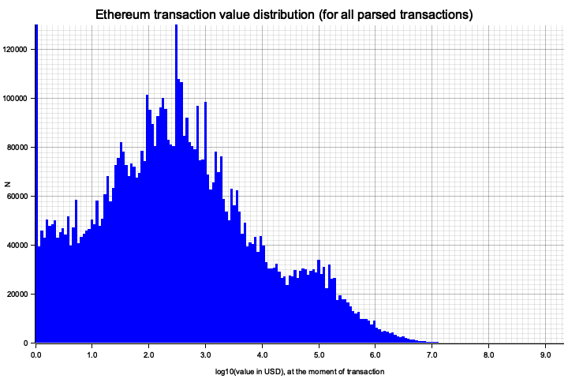
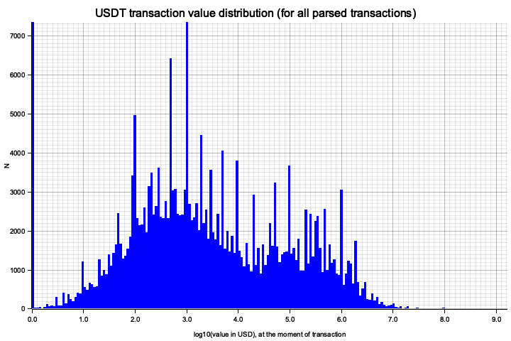
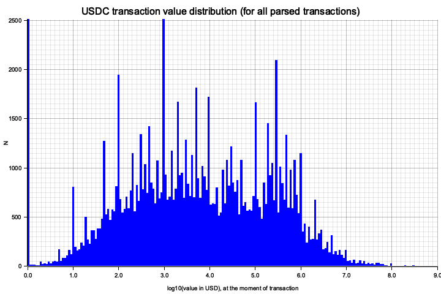
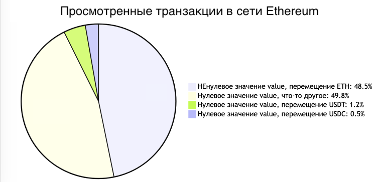
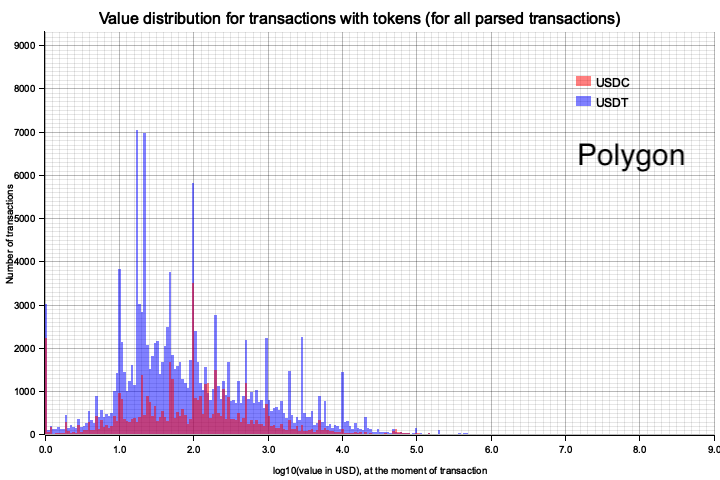
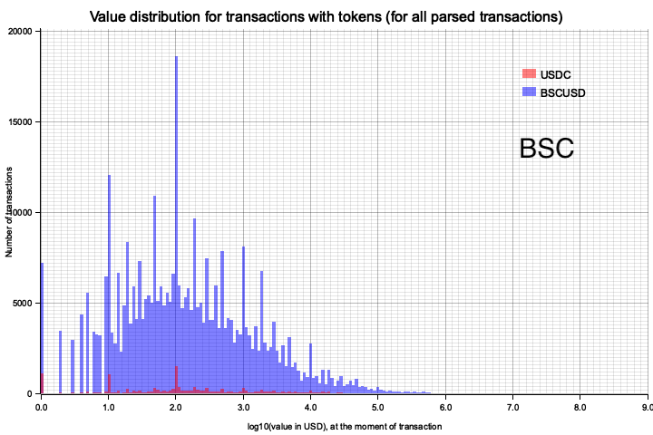

## Транзакции в сети Ethereum
С помощью Etherscan API мы проанализировали 25 миллионов транзакций в сети Ethereum. Транзакции были получены обходом мультиграфа Ethereum, начиная со связанного с Binance адреса 0x4976A4A02f38326660D17bf34b431dC6e2eb2327. Адреса соответствуют вершинам этого мультиграфа, а транзакции — ребрами. Указанный выше адрес был выбран потому, что он участвует в большом количестве транзакций. Во время обхода мультиграфа хранилась и обновлялась очередь из наиболее часто встречающихся в транзакциях адресов. Каждый новый шаг совершался к самому популярному из ещё не посещённых адресов. Такой подход позволяет на каждом шаге парсить наибольшее количество транзакций. С каждого адреса при обходе просматривалось не более 10 тысяч хронологически последних транзакций; из них выбирались только те транзакции, которые соответствуют следующим критериям:
```Rust
 contractAddress == ""
 && isError == "0"
 && from != "GENESIS"
```
То есть те транзакции, которые не связаны с контрактом, были успешными и не являются Genesis транзакциями. Ниже приведён пример выбранной транзакции:
```JSON
{
"blockHash":"0x0b2e24b614a9035e3ad38e62af2a453083f13150dba44be5b19856825c711ce0",
"blockNumber":"19934203",
"from":"0x9a078509314a42af6e6e175d5e3def800af6697e",
"to":"0xa0b86991c6218b36c1d19d4a2e9eb0ce3606eb48",
"gas":"90000",
"gasPrice":"13952663038",
"gasUsed":"40360",
"hash":"0x4691cb7350cafa17bcfd61a9d090ccb1262b9ad1f48b4015765ddc7d4f95c898",
"value":"0",
"nonce":"7",
"transactionIndex":"80",
"timeStamp":"1716486887",
"isError":"0",
"txreceipt_status":"1",
"input":"0xa9059cbb000000000000000000000000f89d7b9c864f589bbf53a82105107622b35eaa4000000000000000000000000000000000000000000000000000000000181571de",
"contractAddress":"",
"cumulativeGasUsed":"6485071",
"functionName":"transfer(address _to, uint256 _value)",
"methodId":"0xa9059cbb"
}
```
Для расчета передаваемой транзакциями ценности мы умножали значение поля value транзакции на 1E-18 (коэффициент для пересчета из wei в ETH) и цену ETH в долларах США на момент транзакции. Значения цен ETH в USD были получены с помощью следующего SQL запроса к БД Dune:
```SQL
SELECT
    to_unixtime(DATE_TRUNC('hour', "minute")) AS "unix_epoch_at_the_start_of_averaging_period",
    AVG("price") AS "average_price_in_usd",
    "symbol"
FROM prices.usd
WHERE "symbol" = 'ETH' AND "contract_address" IS NULL
GROUP BY
    DATE_TRUNC('hour', "minute"),
    "symbol"
ORDER BY
    "unix_epoch_at_the_start_of_averaging_period" DESC
LIMIT 1000;
```
Этот SQL запрос позволяет получить среднюю почасовую стоимость ETH. Использование усреднения дает возможность получить цены на ETH за всю историю наблюдений. Снижение покупательной способности доллара не учитывалось.

Корректность статистического анализа проверяли с помощью создания и ручного обсчета маленького модельного мультиграфа транзакций. Рассчитанные вручную параметры совпали с рассчитанными автоматически для этого модельного мультиграфа.

Тут и далее на графиках по горизонтальной оси отложен десятичный логарифм ценности в долларах США, а по вертикальной оси отложено количество транзакций в данной корзине. Например log10 (value in USD) примерно 6.0 означает, что ценность каждой такой транзакции примерно равна 1E6 = 1_000_000 USD и на графике видно, таких транзакций около 100_000. Всего на графиках по 200 корзин. Ширина корзин различна: чем выше ценность, тем шире корзины. Иными словами, и горизонтальная ось, и ширины корзин логарифмические. Приведенные транзакции не фильтровались по времени; они описывают общую статистику по блокчейну Ethereum. Распределение транзакций ETH в сети Ethereum по ценности в долларах:



**Статистика для транзакций с ETH в сети Ethereum**<br/>
Отправленная транзакциям ценность: 394_471_990_922 USD<br/>
Средняя ценность транзакции: 15_778 USD<br/>
Количество транзакций: 25_000_706<br/>

Интересно, что только 28.6% транзакций имеет ценность выше или равную 1 центу USD. Остальные 71.4% транзакций имеют ценностью < 1 цента, часто нулевую ценность (см. примечание ‡). Транзакциям с нулевой и близкой к нулевой ценностью соответствует пик в крайней левой части графика, бОльшая часть которого не видна при выбранном масштабе. На распределении хорошо заметна компонента транзакций с ценностью около 100_000 USD, а вот транзакций с ценностью выше 10_000_000 USD очень мало. Если оставить только транзакции с ценностью не меньше цента, то получаем следующую статистику:

Отправленная транзакциям (>=0.01 USD) ценность: 394_471_990_889 USD<br/>
Средняя ценность транзакции (>=0.01 USD): 55_135 USD<br/>
Количество транзакций (>=0.01 USD): 7_154_708<br/>

‡ Примечание: Транзакции с нулевой ценностью и транзакции с почти нулевой ценностью мы не разделяли. Из приведенной статистики можно утверждать только то, что транзакций с нулевой ценностью <= 71.4% от всех транзакциий. Приведенный ниже SQL запрос к БД Dune позволяет получить оценку в 51.5% для доли нулевых транзакций при аналогичной фильтрации за 2024 года.
```SQL
WITH t AS (
    SELECT value
    FROM ethereum.transactions
    WHERE 
        "success" = true AND
        EXTRACT(year FROM "block_time") = 2024
)
SELECT 
    ( CAST(COUNT(*) FILTER (WHERE "value" = 0) AS DOUBLE) / 
    CAST(COUNT(*) AS DOUBLE) )
    AS "zero_value_transaction_ratio"
FROM t;
```

### Транзакции с USDT и USDC в сети Ethereum
Данные выше показывают статистику только по перемещению ETH в сети Ethereum. С целью получить статистику по перемещению USDT и USDC мы провели два эксперимента, просмотрев по 10 миллионов транзакций в каждом.

Первый этап фильтрования был таким же, как в эксперименте с ETH, но с дополнительным условием  transaction.value == "0"  (с нулевым значением поля value). Стоит обратить внимание, что нулевое значение поля value не означает нулевое количество USDT или USDC в транзакции — нулевое значение поля value говорит только о том, что у транзакции нулевое перемещаемое количество ETH; количество USDT или USDC же кодируется в поле input. То есть транзакции с нулевым значением поля value могут нести USDT или USDC. 
```Rust
 contractAddress == ""
 && isError == "0"
 && from != "GENESIS" 
 && transaction.value == "0"
```
Транзакции с нулевым значением поля value составляют 51.5% от всех транзакций за 2024 год. Их можно разделить на три категории: транзакции с перемещением USDT, транзакции с перемещением USDC и иные транзакции (многие из которых перемещают другие токены, но в данном эксперименте мы их не рассматривали). Ниже приведены данные по USDT и USDC.




**Статистика для транзакций с USDT**<br/>
Количество просмотренных транзакций: 10_003_726<br/>
Количество найденных транзакций: 235_265 (2.35%)<br/>
Средняя ценность ненулевой транзакции: 375_130 USD<br/>
Средняя ценность транзакции: 8_822 USD<br/>
Отправленная транзакциям ценность: 88_255_036_629 USD<br/>

**Статистика для транзакций с USDC**<br/>
Количество просмотренных транзакций: 10_004_501<br/>
Количество найденных транзакций: 98_506 (0.98%)<br/>
Средняя ценность ненулевой транзакции: 709_041 USD<br/>
Средняя ценность транзакции: 6_981 USD<br/>
Отправленная транзакциям ценность: 69_844_827_233 USD<br/>

Среди транзакций с нулевым значением поля value только в 2.35% происходит перемещение USDT (51.5% * 2.35% = 1.2% от всех транзакций) и только в 0.98% происходит перемещение USDC (51.5% * 0.98% = 0.5% от всех транзакций). Транзакций с USDC меньше, но они в среднем несут большую ценность. В итоге транзакции с USDT и транзакции с USDC создают похожие объемы перемещения ценности. 



## Транзакции с USDT и USDC в сети Polygon 
Методология анализа транзакций с токенами USDT и USDC в сети Polygon была похожа на использованную ранее методологию для сети Ethereum. В данном эксперименте мы проделали следующие шаги:

1. Мы взяли данные о мощности сети Polygon за 2024 год [отсюда](https://polygonscan.com/chart/tx). Она сильно менялась с ноября по декабрь 2023 года, но за 2024 год была почти постоянна и составляла около 4_000_000 транзакций в день.
2. С помощью SQL запроса к БД Dune (аналогичного приведённому выше запросу) мы получили долю транзакций с нулевым значением поля value для сети Polygon за 2024 год — 85.7%.
3. Мы просмотрели 10_002_728 транзакций с нулевым значением поля value, отфильтровали транзакции с USDC и USDT, в которых использовались on-chain функции Transfer и TransferFrom. Результаты:



**Статистика для транзакций с USDC**<br/>
Количество просмотренных транзакций: 10_002_728<br/>
Количество найденных транзакций: 49_188 (0.49 %)<br/>
Средняя ценность транзакции: 2391 USD<br/>
Отправленная транзакциям ценность: 117_584_394 USD<br/>

**Статистика для транзакций с USDT**<br/>
Количество просмотренных транзакций: 10_002_728<br/>
Количество найденных транзакций: 139_715 (1.40 %)<br/>
Средняя ценность транзакции: 2495 USD<br/>
Отправленная транзакциям ценность: 348_611_442 USD<br/>

## Транзакции с BSCUSD и USDC в сети BSC (BNB Smart Chain)
Методология для анализа транзакций с токенами BSCUSD и USDC в сети BSC полностью аналогична использованной ранее методологии для сети Polygon. В данном эксперименте мы проделали следующие шаги:

1. Мы взяли данные о мощности сети BSC за 2024 год [отсюда](https://bscscan.com/chart/tx). Она сильно менялась с ноября по декабрь 2023 года, но за 2024 год была почти постоянна и составляла около 4_000_000 транзакций в день (да, это почти численное совпадение с мощностью Polygon).
2. С помощью SQL запроса к БД Dune (аналогичного приведённому выше запросу) мы получили долю транзакций с нулевым значением поля value для сети BSC за 2024 год — 77.49%.
3. Мы просмотрели 10_005_859 транзакций с нулевым значением поля value, отфильтровали транзакции с BSCUSD и USDC, в которых использовались on-chain функции Transfer и TransferFrom. Результаты:



**Статистика для транзакций с USDC**<br/>
Количество просмотренных транзакций: 10_005_859<br/>
Количество найденных транзакций:  15_431 (0.15%)<br/>
Средняя ценность транзакции: 319_986 USD<br/>
Отправленная транзакциям ценность: 4_937_706_788 USD<br/>

**Статистика для транзакций с BSCUSD**<br/>
Количество просмотренных транзакций: 10_005_859<br/>
Количество найденных транзакций: 367_433 (3.67%)<br/>
Средняя ценность транзакции: 30_990 USD<br/>
Отправленная транзакциям ценность: 11_386_906_760 USD<br/>

Высокая средняя стоимость транзакций с USDC объясняется тем, что мы просмотрели в том числе семнадцать транзакций с ценностью > 1E8 USD  каждая, например см. эту транзакцию:<br/>
https://bscscan.com/tx/0x495974a6473cf0990d008547799e71cf269f0eb48a0dbddba5559b9d3e5fb92a 
